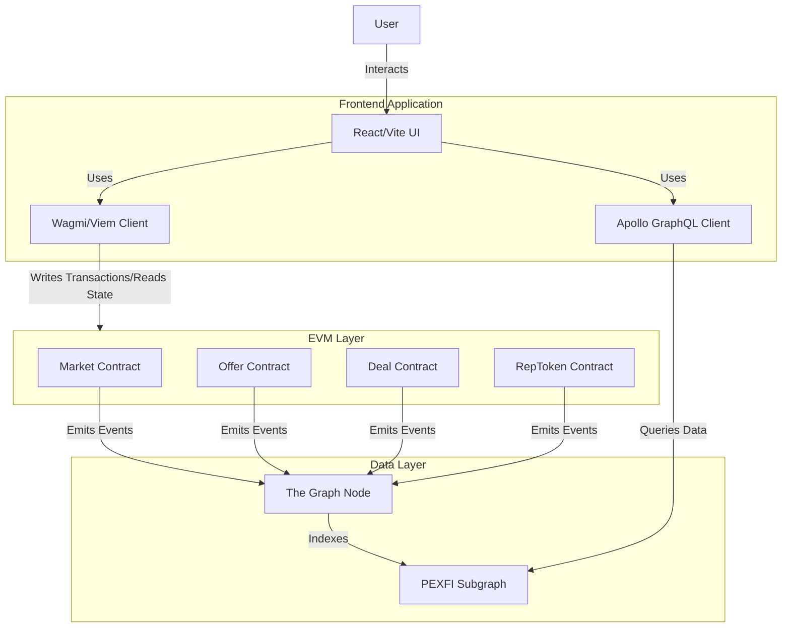

# PEXFI Protocol Architecture

PEXFI is built as a decentralized application (dApp) that interacts directly with EVM-compatible blockchains. The system consists of three main layers: the User Interface, the Indexing Layer, and the On-Chain Protocol.

## High-Level Diagram

The following diagram illustrates the data flow and interaction between components.

## Component Breakdown

### 1. Frontend Layer (`/src`)

- **Tech Stack:** React, Vite, TypeScript, TailwindCSS.
- **Role:** The primary interface for users. It manages wallet connections, displays marketplace data, and constructs transactions.
- **Interaction:**
  - **Writes:** Uses `wagmi` and `viem` to propose trades, fund escrows, and disputes directly to the smart contracts.
  - **Reads:** Fetches complex data aggregations/filtering from The Graph and reads real-time contract state (e.g., balances) directly from RPC.

### 2. On-Chain Protocol (`/evm`)

- **Tech Stack:** Solidity, Hardhat.
- **Role:** The "backend" logic of the system. Immutably handles all value transfers and state changes.
- **Key Contracts:**
  - **Market:** Registry for offers and fee management.
  - **Deal:** Individual escrow capabilities for each trade.
  - **RepToken:** Soulbound NFT logic for reputation tracking.

### 3. Indexing Layer (`/subgraph`)

- **Tech Stack:** The Graph Protocol (AssemblyScript).
- **Role:** An indexing middleware that listens to blockchain events and organizes them into queriable schemas.
- **Purpose:** Allows the frontend to efficiently query things like "All offers for BTC" or "My trade history" without scanning the entire blockchain on every page load.
