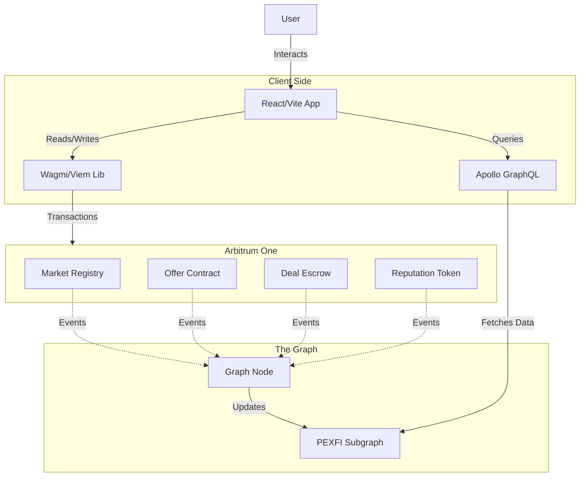

# PEXFI Protocol Architecture

PEXFI is a decentralized application (dApp) designed for resilience, security, and censorship resistance. It interacts directly with EVM-compatible blockchains to facilitate trustless trading.

The system is composed of three primary layers:
1. **Frontend Layer**: The user interface.
2. **On-Chain Protocol**: The smart contracts (EVM).
3. **Indexing Layer**: Data aggregation (The Graph).

## High-Level Data Flow

The following diagram illustrates how these components interact to provide a seamless user experience.

## Component Breakdown

### 1. Frontend Layer (`/src`)

- **Technology**: React, Vite, TypeScript, TailwindCSS.
- **Function**: Serves as the gateway for users to interact with the protocol. It is responsible for:
  - **Wallet Connection**: Managing sessions via `wagmi` and `RainbowKit` (or similar).
  - **Transaction Construction**: Formatting data to call smart contract functions.
  - **Data Display**: Merging real-time blockchain data (via RPC) with indexed historical data (via The Graph).

### 2. On-Chain Protocol (`/evm`)

- **Technology**: Solidity, Hardhat.
- **Function**: The immutable logic layer that enforces rules and holds funds.
- **Key Contracts**:
  - **`Market.sol`**: The central registry for all offers and global configuration.
  - **`Offer.sol`**: Represents a user's intent to trade. Stores parameters like price, limits, and payment methods.
  - **`Deal.sol`**: A unique escrow contract deployed for every single trade. It holds the crypto assets until the trade is finalized or disputed.
  - **`Reputation.sol`**: A soulbound token (SBT) system that tracks user history and ratings on-chain.

### 3. Indexing Layer (`/subgraph`)

- **Technology**: The Graph Protocol (AssemblyScript).
- **Function**: An indexing middleware that organizes blockchain data for efficient querying.
- **Why it's needed**: Reading data directly from the blockchain is slow and limited (e.g., "Show me all offers selling USDT for EUR"). The subgraph listens for events (like `OfferCreated`, `DealFinalized`) and stores them in a schema that the frontend can query instantly via GraphQL.
