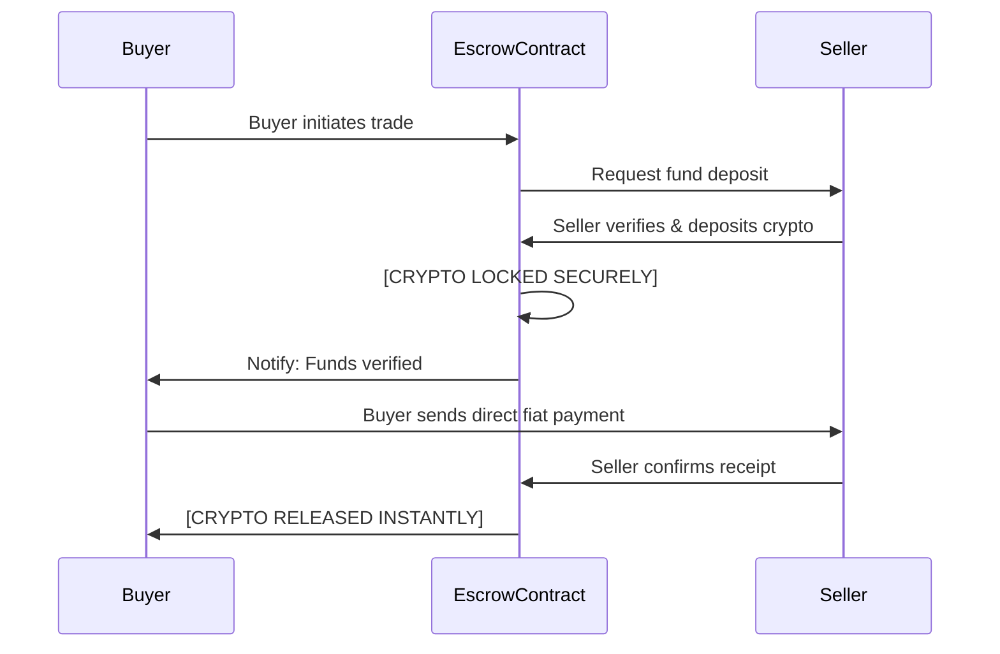

# Secure, Non-Custodial Trading Technology

**PEXFI uses advanced blockchain infrastructure to ensure your crypto trading is secure, private, and unstoppable.**

We replace trusted intermediaries with verified code.

## The Smart Contract Escrow Mechanism

The core of our platform is the **Non-Custodial Escrow**. This smart contract acts as an impartial robotic intermediary.

### Advantages of On-Chain Escrow

1.  **Trustless Security**: Funds are locked in a public contract, not a private corporate wallet.
2.  **No Insolvency Risk**: The protocol cannot lend, invest, or misuse your funds.
3.  **Atomic Settlement**: Transactions settle instantly on the blockchain once conditions are met.

## Decentralized Infrastructure Stack

To ensure **censorship resistance** and **high availability**, PEXFI utilizes a fully distributed technology stack:

- **Ethereum**: Provides security with low gas fees and fast transaction confirmation.
- **IPFS Hosting**: Our frontend runs on the InterPlanetary File System, making it resistant to server takedowns or DNS blocks.
- **On-Chain Messaging**: Trade chats are encrypted and stored on-chain (logs), ensuring an immutable record for dispute resolution.

**Trade with confidence on the most robust P2P exchange infrastructure.**
