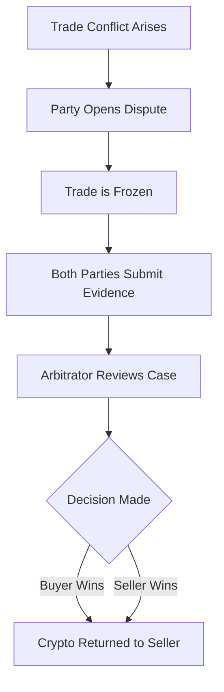

# Dispute Resolution

In an ideal world, every trade goes smoothly. However, when conflicts arise, PEXFI's decentralized dispute system helps resolve them fairly.

## When to Open a Dispute

You should open a dispute if:

- **Buyer**: You sent payment, but the seller is refusing to release the crypto.
- **Seller**: The buyer marked the trade as "Paid," but you haven't received the money.
- **Mismatch**: The payment amount received is incorrect.
- **Unresponsive**: The counterparty stopped replying after the trade started.
- **Fraud**: You suspect the counterparty is attempting to scam you.

<Warning>
  **Do not open disputes for minor delays.** Bank transfers can take time. Communicate with your trading partner first.
</Warning>

## How the Process Works

### Step 1: Open Dispute

Either party can click the **Dispute** button on the deal page.
- This action **locks the funds** in the smart contract. Neither party can withdraw them without an arbitrator's ruling.
- An arbitrator is assigned to the case.

### Step 2: Submit Evidence

You must provide clear proof to support your claim. This is done directly in the chat or via a designated evidence form.

| Evidence Type   | Examples                              |
| --------------- | ------------------------------------- |
| **Payment Proof**   | Bank transfer receipts, transaction hash, PDF statements. |
| **Chat Logs**   | The on-chain chat history is automatically available to the arbitrator.               |
| **Timestamps**      | Proof of when actions were taken.               |
| **Account Details** | Showing that the sender/receiver names match the trade details.          |

<Tip>The burden of proof is on you. Provide as much detail as possible to ensure a fair outcome.</Tip>

### Step 3: Arbitrator Review

The arbitrator reviews:
1. The **contract state** (was money escrowed? was "Mark as Paid" clicked?).
2. The **encrypted chat logs** (if access is granted).
3. The **external evidence** submitted by both parties.
4. The **reputation history** of both traders.

### Step 4: Resolution

The arbitrator has the power to:
- **Release funds to the Buyer** (if payment is proven).
- **Return funds to the Seller** (if no payment was made).

<Note>Arbitrators **cannot** take the funds for themselves or send them to a third party. They can only direct funds to one of the two participants.</Note>

## Fraud Prevention Strategies

PEXFI is designed to minimize fraud, but you should stay vigilant.

### Payment Fraud
- **Sellers**: Always verify the money is *actually* in your account. Do not trust emails claiming "funds are on hold."
- **Buyers**: Use payment methods that provide a receipt.

### Triangle Scams
- Ensure the name on the bank account matches the name of the user you are trading with.
- Be wary of users asking you to pay a third party.

### Impersonation
- Only communicate through the PEXFI chat.
- PEXFI support will **never** ask for your private keys or seed phrase.

## Best Practices to Avoid Disputes

<Steps>
  <Step title="Clarify Terms">Agree on exact amounts and timing before starting.</Step>
  <Step title="Use Correct Details">Double-check bank account numbers and references.</Step>
  <Step title="Be Patient">Allow reasonable time for banking systems to process transfers.</Step>
  <Step title="Keep Records">Save all receipts and screenshots until the trade is finalized.</Step>
</Steps>
