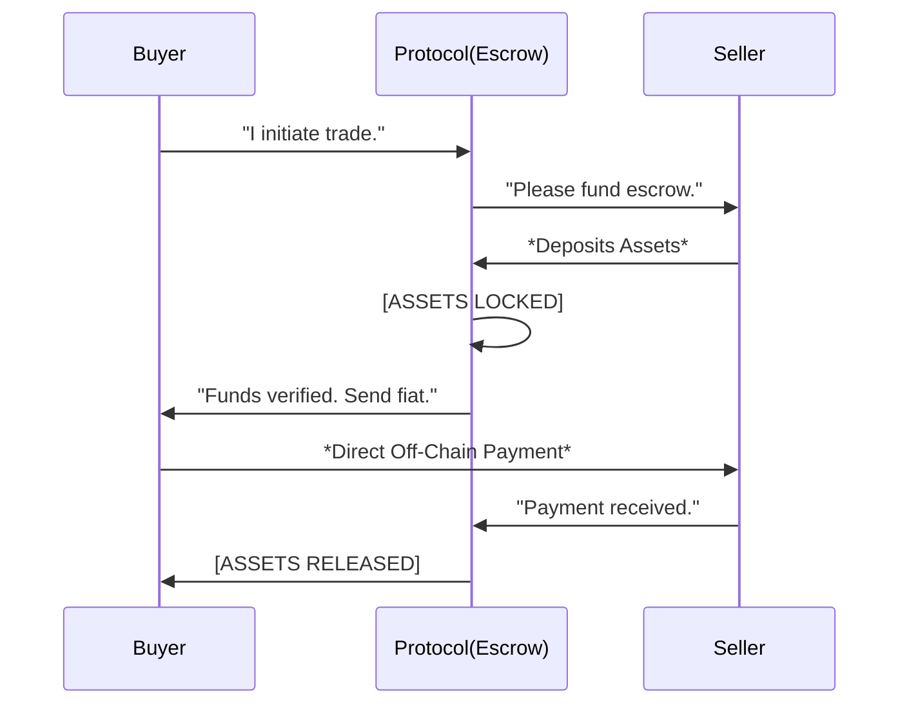

# Built for Security

**The safest way to trade is to remove the need for trust.**

PEXFI replaces the "trusted intermediary" model of CEXs with a verified cryptographic protocol. We don't ask you to trust our company; we invite you to verify our code.

## The Escrow Mechanism

At the core of PEXFI is a non-custodial multisignature smart contract. This contract acts as an impartial robotic escrow agent that executes trades strictly according to pre-defined rules.

### Why This is Superior to CEXs

1.  **No Commingling**: Your funds are never mixed with other users' funds or corporate assets.
2.  **No Insolvency Risk**: The contract cannot lend out your money or invest it elsewhere. It simply holds it until the trade is done.
3.  **Atomic Settlement**: Once conditions the are met, settlement is instant and guaranteed by the blockchain.

## Decentralized Infrastructure

To avoid the single points of failure that plague centralized changes, PEXFI utilizes distributed technologies:

- **On-Chain Messaging**: Trade communications are recorded on the blockchain, creating an immutable audit trail for dispute resolution.
- **IPFS Hosting**: The frontend interface is hosted on the InterPlanetary File System, ensuring access even if traditional servers go offline.
- **EVM Foundation**: Built on Ethereum Layer 2 to combine the security of the world's most robust blockchain with the speed required for modern trading.

**PEXFI is infrastructure that respects your sovereignty.**
