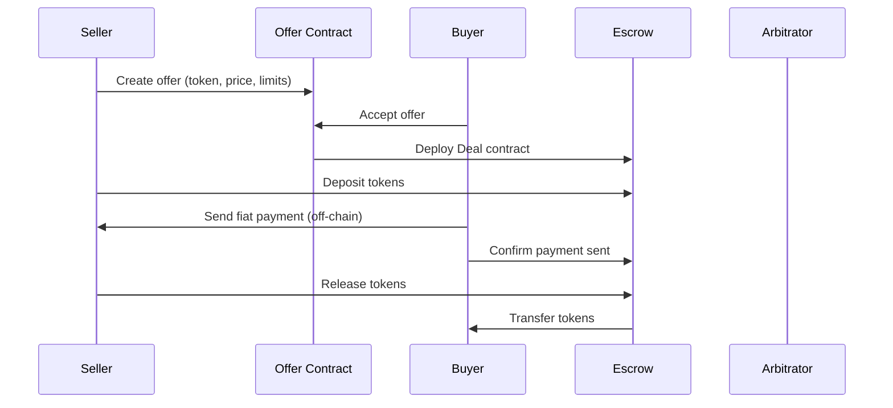

# How PEXFI Works

PEXFI is built on a fully decentralized architecture where every trade is secured by smart contracts. No central party ever holds your funds.

## Trade Flow

## Key Components

### Smart Contract Escrow

Funds are locked in a **multisignature escrow** smart contract until both parties agree. The escrow system:

- Holds tokens securely until trade completion
- Supports multiple parties: buyer, seller, and arbitrator
- Only releases funds when conditions are met or dispute is resolved
- Fully auditable and open-source

<Note>Arbitrators can only direct funds to either the buyer or seller — never to themselves or third parties.</Note>

### On-Chain Messaging

All trade-related communication happens on the blockchain:

- No external chat systems required
- Complete transparency for dispute resolution
- Future: end-to-end encryption with zero-knowledge proofs

### Decentralized Frontend

The PEXFI interface is designed for censorship resistance:

- Hosted on IPFS for decentralized access
- Direct browser-to-peer connections via WebRTC
- No single point of failure
