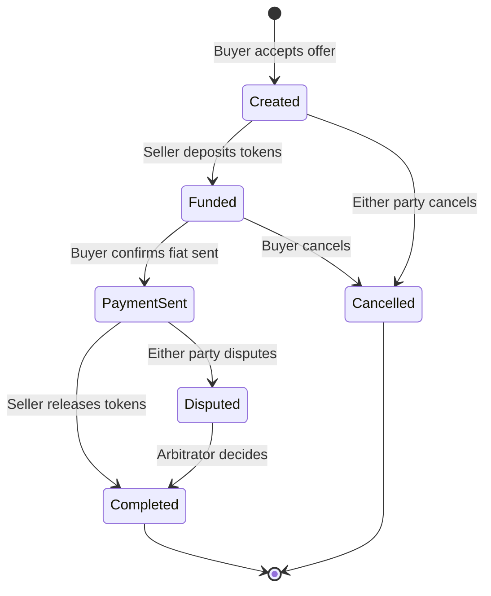

# Deals

A deal is an active trade between two parties, secured by a smart contract escrow.

## Deal Lifecycle

## Deal States

| State            | Description                                       |
| ---------------- | ------------------------------------------------- |
| **Created**      | Deal initiated, waiting for seller to fund escrow |
| **Funded**       | Tokens locked in escrow, waiting for fiat payment |
| **Payment Sent** | Buyer claims to have sent fiat                    |
| **Completed**    | Trade successful, tokens released to buyer        |
| **Disputed**     | Conflict escalated to arbitrator                  |
| **Cancelled**    | Trade cancelled, tokens returned to seller        |

## Taking Part in a Deal

### As a Buyer

1. Find an offer in the marketplace
2. Enter the amount you want to trade
3. Accept the offer — a deal contract is created
4. Wait for seller to fund the escrow
5. Send fiat payment using agreed method
6. Mark payment as sent in the deal
7. Receive tokens when seller confirms

### As a Seller

1. Wait for buyers to accept your offer
2. Review the deal details
3. Fund the escrow with tokens
4. Wait for buyer's fiat payment
5. Verify payment received in your account
6. Release tokens to buyer

## On-Chain Messaging

Each deal has a built-in message board on the blockchain:

- Share payment details securely
- Coordinate with your counterparty
- All messages are recorded for dispute resolution

<Tip>Keep all communication within the deal. Off-platform messages may not be considered in disputes.</Tip>

## Cancellation

Either party can cancel a deal before completion:

- **Before funding** — No tokens at risk
- **After funding** — Tokens return to seller (if buyer cancels)
- **After payment sent** — May require dispute resolution
