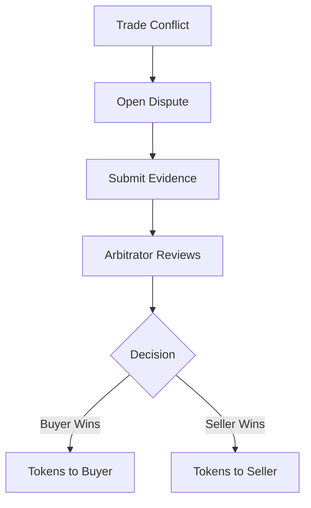

# Dispute Resolution

When trades don't go as planned, PEXFI's dispute system helps resolve conflicts fairly.

## When to Open a Dispute

Open a dispute if:

- Buyer claims payment was sent but seller disagrees
- Seller claims payment wasn't received
- Payment amount doesn't match
- One party is unresponsive
- Suspected fraud or scam attempt

<Warning>Don't open disputes for minor delays. Allow reasonable time for responses and payment processing.</Warning>

## How Disputes Work

### Step 1: Open Dispute

Either party can initiate a dispute from the deal page. This:

- Pauses the trade
- Notifies both parties
- Assigns an arbitrator

### Step 2: Submit Evidence

Provide documentation to support your case:

| Evidence Type   | Examples                              |
| --------------- | ------------------------------------- |
| Payment Proof   | Transaction receipts, bank statements |
| Communication   | Screenshots of messages               |
| Timestamps      | When actions were taken               |
| Account Details | Matching payment information          |

<Tip>The more evidence you provide, the easier it is for the arbitrator to decide.</Tip>

### Step 3: Arbitrator Review

An arbitrator examines:

- On-chain deal messages
- Submitted evidence
- Transaction history
- Reputation of both parties

### Step 4: Resolution

The arbitrator can only:

- Release tokens to the **buyer**
- Return tokens to the **seller**

<Note>Arbitrators cannot take funds for themselves or send them elsewhere.</Note>

## Fraud Prevention

PEXFI employs multiple fraud mitigation strategies:

### Payment Fraud

- Use irreversible payment methods when possible
- Verify payment sender matches deal participant
- Wait for payment to fully clear before releasing

### Non-Release Scams

- Escrow ensures funds are locked
- Arbitrator can force release with evidence

### Identity Fraud

- Trade only through the platform
- Verify wallet addresses match
- Trust reputation, not display names

## Avoiding Disputes

<Steps>
  <Step title="Clear Communication">Discuss terms before starting</Step>
  <Step title="Follow Instructions">Use correct payment details</Step>
  <Step title="Be Patient">Allow time for payment processing</Step>
  <Step title="Document Everything">Keep records in the deal chat</Step>
</Steps>

## Arbitrator Selection

Currently, arbitrators are vetted by the platform. Future plans include:

- Decentralized arbitrator pool
- Staking requirements for arbitrators
- Community governance over dispute policies
- Multi-arbitrator consensus for large disputes
