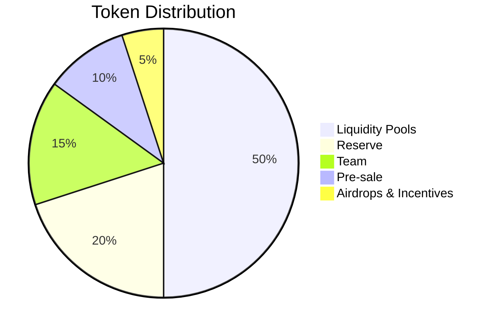

# Tokenomics

The PEXFI token powers the platform economy — from fee discounts to governance.

## Token Overview

| Property         | Value               |
| ---------------- | ------------------- |
| **Name**         | PEXFI               |
| **Total Supply** | 100,000,000 (fixed) |
| **Type**         | ERC-20              |

## Distribution

| Allocation          | Percentage | Details                                             |
| ------------------- | ---------- | --------------------------------------------------- |
| **Liquidity Pools** | 50%        | Initial and future DEX pools                        |
| **Reserve**         | 20%        | Development & ecosystem growth. Locked 12 months.   |
| **Team**            | 15%        | 24-month vesting, 6-month cliff                     |
| **Pre-sale**        | 10%        | Seed first liquidity pool. Locked at listing price. |
| **Airdrops**        | 5%         | Early users and contributors                        |

## Fee Model

### Trading Fees

| Payment Method            | Fee Per Side |
| ------------------------- | ------------ |
| **Pay with PEXFI**        | 0.25%        |
| **Pay with other tokens** | 0.50%        |

<Note>Paying fees in PEXFI gives you a 50% discount.</Note>

### Automatic Conversion

When fees are paid in other tokens, the platform swaps them to PEXFI on a DEX. This creates **consistent buy pressure** as trading volume grows.

## Treasury

All fees flow into the Treasury contract and are allocated:

| Fund               | Allocation | Purpose                              |
| ------------------ | ---------- | ------------------------------------ |
| **Staker Rewards** | 50%        | Arbitration and staking payouts      |
| **Protocol Fund**  | 40%        | Development, marketing, integrations |
| **Operations**     | 10%        | Audits, support, infrastructure      |

## Token Utility

<CardGroup cols={2}>
  <Card title="Fee Discounts" icon="percent">
    Save 50% on trading fees when paying with PEXFI
  </Card>
  <Card title="Staking Rewards" icon="piggy-bank">
    Stake tokens to earn a share of platform fees
  </Card>
  <Card title="Governance" icon="check-to-slot">
    Vote on platform decisions and dispute policies
  </Card>
  <Card title="NFT Badges" icon="id-badge">
    Purchase profile badges for visibility and ranking
  </Card>
</CardGroup>

### Additional Benefits

- **Offer Promotion** — Boost visibility in marketplace
- **Dispute Arbitration** — Stake to become an arbitrator
- **Fee Refunds** — Earn partial refund for leaving reviews

## Value Drivers

### Buy Pressure

- Fee conversion from other tokens
- Staking lockups
- Badge purchases

### Supply Controls

- Fixed supply (no minting)
- Slashing burns for arbitrator misconduct
- Locked allocations

<Tip>As trading volume grows, so does the demand for PEXFI through automatic fee conversion.</Tip>
