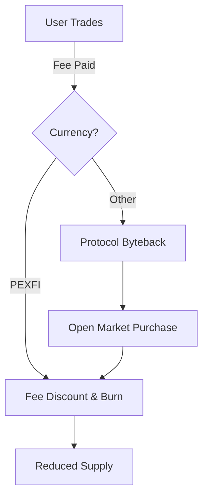

# PEXFI Tokenomics

**A protocol should reward those who secure and use it.**

The PEXFI token ($PEXFI) is the utility and governance instrument of the platform. It is designed to create a sustainable economic loop where platform growth directly benefits the user community.

## The Economic Model

Unlike centralized platforms where fees promote corporate profit, PEXFI fees contribute to the protocol's health and deflationary mechanics.

### 1. Market-Driven Demand

When users pay trading fees in other currencies, the protocol programmatically purchases PEXFI from the open market. This ensures that **trading volume correlates with token demand.**

### 2. Deflationary Supply

A portion of every fee is permanently removed from circulation (burned). As the platform usage grows, the total supply of PEXFI decreases, creating natural scarcity for long-term holders.

### 3. Practical Utility

The token provides tangible benefits to active users:

- **Fee Reductions**: Paying fees in PEXFI reduces trading costs by 50%.
- **Staking Yield**: Stakers earn a share of protocol revenue for securing the network.
- **Governance Rights**: Token holders vote on critical parameters, such as fee rates and dispute policies.

## Transparent Distribution

Our distribution model prioritizes long-term ecosystem health over short-term speculation.

| Allocation        | Purpose                                                    |
| ----------------- | ---------------------------------------------------------- |
| **50% Liquidity** | Ensures deep markets for seamless entry and exit.          |
| **20% Reserve**   | Strategic funding for future development and partnerships. |
| **15% Team**      | Vested over 24 months to ensure long-term commitment.      |
| **10% Seed**      | Initial capital to bootstrap the protocol.                 |
| **5% Community**  | Incentives for early adopters and active contributors.     |

## The Treasury

The Treasury acts as the protocol's transparent on-chain bank account, managed for the benefit of the ecosystem:

- **50%** funds staking rewards (yield).
- **40%** funds protocol development and growth.
- **10%** ensures operational security and audits.

**PEXFI aligns the incentives of traders, holders, and builders.**
