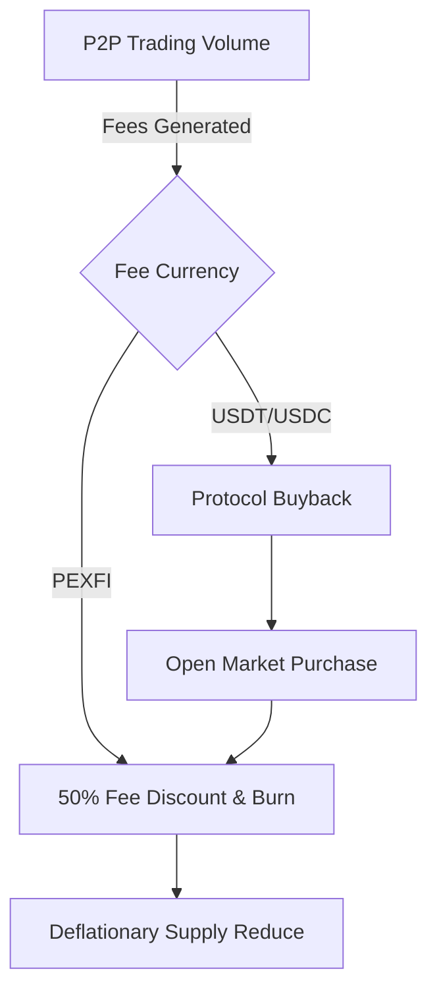

# PEXFI Tokenomics

**A sustainable, deflationary token model for the decentralized exchange economy.**

The PEXFI token ($PEXFI) is the native utility and governance token of the PEXFI marketplace. It creates a **circular economy** where platform growth directly benefits token holders through yield and scarcity.

## Deflationary Economic Model

PEXFI employs a **Buyback and Burn** mechanism to link trading volume with token value. Unlike inflationary tokens, PEXFI is designed to become scarcer over time.

### Key Token Utility

1.  **Fee Discounts**: Traders who pay fees in $PEXFI receive a **50% discount**, driving organic demand for the token.
2.  **Staking Rewards**: Holders can stake PEXFI to earn a share of platform revenue, creating a passive income stream from exchange volume.
3.  **Governance**: $PEXFI is a governance token, giving the community voting power over protocol parameters and dispute resolution policies.

## Sustainable Token Distribution

Our allocation allows for long-term ecosystem development and liquidity provision.

| Allocation               | Percentage | Purpose                                          |
| :----------------------- | :--------- | :----------------------------------------------- |
| **Liquidity Pools**      | 50%        | Ensures deep liquidity for low-slippage trading. |
| **Strategic Reserve**    | 20%        | Funding for partnerships, marketing, and growth. |
| **Team Vesting**         | 15%        | 24-month vesting to align team incentives.       |
| **Seed Round**           | 10%        | Initial capital for protocol launch.             |
| **Community Incentives** | 5%         | Airdrops and rewards for early adopters.         |

## The On-Chain Treasury

The PEXFI Treasury is a transparent, smart-contract-managed fund:

- **50%** of revenue goes to **Staking Yield** (Real Yield).
- **40%** funds **Development & Marketing** to grow the user base.
- **10%** covers **Security Audits** and operations.

**Invest in the future of non-custodial crypto trading.**
